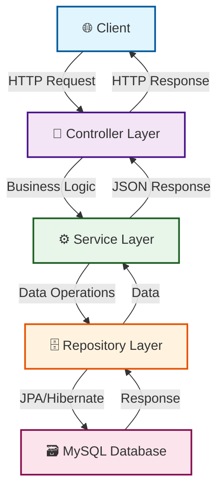

<div align="center">

# 💼 Job Portal - Spring Boot REST API


[](https://spring.io/projects/spring-boot)
[](https://www.oracle.com/java/)
[](https://www.mysql.com/)
[](LICENSE)

**A production-ready RESTful Job Portal API with advanced features**

[🚀 Features](#-features) • [🛠️ Tech Stack](#️-tech-stack) • [📥 Installation](#-installation) • [📚 API Docs](#-api-endpoints) • [🤝 Contributing](#-contributing)


</div>

---

## 📋 Overview


This is a **production-ready Job Portal application** built using **Spring Boot**. The system enables:

- 🎯 **Job Seekers** to discover and apply for jobs
- 🏢 **Employers** to post job listings and manage applications  
- 🔐 **Secure Authentication** with role-based access control
- 📊 **Analytics & Tracking** for applications and candidates

Perfect for learning Spring Boot or building your job portal platform!

<br clear="right"/>

## ✨ Features

<table>
<tr>
<td width="50%">

### 🔐 Security & Authentication
- ✅ BCrypt password encryption
- ✅ Stateless authentication
- ✅ Role-based access (Admin/Job Seeker/Employer)
- ✅ Spring Security integration

</td>
<td width="50%">

### 💼 Job Management
- ✅ Create & manage job listings
- ✅ Advanced search & filters
- ✅ Category-based organization
- ✅ Company profiles

</td>
</tr>
<tr>
<td width="50%">

### 📤 Application Tracking
- ✅ One-click job applications
- ✅ Application status tracking
- ✅ Employer review system
- ✅ Candidate management

</td>
<td width="50%">

### 🗄️ Database & Architecture
- ✅ MySQL persistent storage
- ✅ JPA/Hibernate ORM
- ✅ RESTful API design
- ✅ Layered architecture

</td>
</tr>
</table>

## 🛠️ Tech Stack

<div align="center">


</div>

## 📂 Project Structure

<details>
<summary>📁 Click to expand folder structure</summary>

```
job-portal/
│
├── 📁 src/
│   ├── 📁 main/
│   │   ├── 📁 java/com/basharat/JobPortal/
│   │   │   │
│   │   │   ├── 🎯 controller/           # REST API Controllers
│   │   │   │   ├── 📄 UserController.java
│   │   │   │   ├── 📄 EmployeeController.java
│   │   │   │   ├── 📄 JobController.java
│   │   │   │   ├── 📄 JobApplicationController.java
│   │   │   │   └── 📄 JobCategoryController.java
│   │   │   │
│   │   │   ├── 📊 model/                # JPA Entities
│   │   │   │   ├── 📄 User.java
│   │   │   │   ├── 📄 Employee.java
│   │   │   │   ├── 📄 Job.java
│   │   │   │   ├── 📄 JobApplication.java
│   │   │   │   └── 📄 JobCategory.java
│   │   │   │
│   │   │   ├── 🗄️ repository/          # Data Access Layer
│   │   │   │   ├── 📄 UserRepository.java
│   │   │   │   ├── 📄 EmployeeRepository.java
│   │   │   │   ├── 📄 JobRepository.java
│   │   │   │   ├── 📄 JobApplicationRepository.java
│   │   │   │   └── 📄 JobCategoryRepository.java
│   │   │   │
│   │   │   ├── ⚙️ service/              # Business Logic
│   │   │   │   ├── 📄 UserService.java
│   │   │   │   ├── 📄 UserServiceImpl.java
│   │   │   │   ├── 📄 EmployeeService.java
│   │   │   │   ├── 📄 EmployeeServiceImpl.java
│   │   │   │   ├── 📄 JobService.java
│   │   │   │   ├── 📄 JobServiceImpl.java
│   │   │   │   ├── 📄 JobApplicationService.java
│   │   │   │   ├── 📄 JobApplicationServiceImpl.java
│   │   │   │   ├── 📄 JobCategoryService.java
│   │   │   │   └── 📄 JobCategoryServiceImpl.java
│   │   │   │
│   │   │   ├── 🔧 config/               # Configuration
│   │   │   │   └── 📄 SecurityConfig.java
│   │   │   │
│   │   │   └── 📄 JobPortalApplication.java
│   │   │
│   │   └── 📁 resources/
│   │       ├── 📄 application.properties
│   │       ├── 📁 static/
│   │       └── 📁 templates/
│   │
│   └── 📁 test/
│       └── 📁 java/
│           └── 📄 JobPortalApplicationTests.java
│
├── 📄 pom.xml
├── 📄 README.md
├── 📄 LICENSE
└── 📄 .gitignore
```

</details>

## 🏗️ Architecture Flow

<div align="center">



</div>

## 💾 Database Schema

<details>
<summary>🗃️ Click to view database relationships</summary>

```
┌─────────────────────┐
│       👤 USERS      │
├─────────────────────┤
│ 🔑 id (PK)          │
│ 📧 username         │
│ 🔒 password         │
│ 📧 email            │
│ 👔 role             │
└──────────┬──────────┘
           │ 1:1
           ▼
┌─────────────────────┐         ┌─────────────────────┐
│   🏢 EMPLOYEES      │    1:N  │      💼 JOBS        │
├─────────────────────┤◄────────├─────────────────────┤
│ 🔑 id (PK)          │         │ 🔑 id (PK)          │
│ 🔗 user_id (FK)     │         │ 📝 title            │
│ 🏢 company_name     │         │ 📄 description      │
│ 📄 description      │         │ 🔗 company_id (FK)  │
└─────────────────────┘         │ 🔗 category_id (FK) │
                                └──────────┬──────────┘
                                           │ 1:N
           ┌───────────────────────────────┘
           │
           ▼
┌─────────────────────┐         ┌─────────────────────┐
│  📋 JOB_APPLICATIONS│         │   🏷️ JOB_CATEGORIES │
├─────────────────────┤         ├─────────────────────┤
│ 🔑 id (PK)          │         │ 🔑 id (PK)          │
│ 🔗 job_seeker_id    │         │ 📌 name             │
│ 🔗 job_id (FK)      │         └─────────────────────┘
│ 📊 status           │
│ 📅 application_date │
└─────────────────────┘
```

</details>

## 🚀 API Endpoints

<details>
<summary>👤 User Management APIs</summary>

| Method | Endpoint | Description |
|--------|----------|-------------|
| `POST` | `/api/users/register` | Register new user |
| `POST` | `/api/users/login` | User login |
| `GET` | `/api/users/username/{username}` | Get user by username |
| `GET` | `/api/users/email/{email}` | Get user by email |

</details>

<details>
<summary>🏢 Employee/Employer Management APIs</summary>

| Method | Endpoint | Description |
|--------|----------|-------------|
| `POST` | `/api/employees/register` | Register company/employer |
| `PUT` | `/api/employees/update` | Update company profile |
| `GET` | `/api/employees/user/{userId}` | Get employee by user ID |

</details>

<details>
<summary>💼 Job Management APIs</summary>

| Method | Endpoint | Description |
|--------|----------|-------------|
| `POST` | `/api/jobs` | Create new job |
| `GET` | `/api/jobs` | Get all jobs |
| `GET` | `/api/jobs/company/{companyId}` | Get jobs by company |
| `GET` | `/api/jobs/search?keyword=` | Search jobs by keyword |
| `GET` | `/api/jobs/category/{categoryId}` | Get jobs by category |

</details>

<details>
<summary>📋 Job Application Management APIs</summary>

| Method | Endpoint | Description |
|--------|----------|-------------|
| `POST` | `/api/job-applications` | Submit job application |
| `GET` | `/api/job-applications` | Get all applications |
| `GET` | `/api/job-applications/job-seeker/{jobSeekerId}` | Get applications by job seeker |
| `GET` | `/api/job-applications/job/{jobId}` | Get applications for specific job |
| `PUT` | `/api/job-applications/{id}/status` | Update application status |

</details>

<details>
<summary>🏷️ Job Category Management APIs</summary>

| Method | Endpoint | Description |
|--------|----------|-------------|
| `POST` | `/api/job-categories` | Add new category |
| `GET` | `/api/job-categories` | Get all categories |
| `PUT` | `/api/job-categories/{id}` | Update category |
| `DELETE` | `/api/job-categories/{id}` | Delete category |

</details>

## 📥 Installation

### Prerequisites

<div align="center">

| Requirement | Version | Download |
|------------|---------|----------|
| ☕ Java | 17+ | [Download](https://www.oracle.com/java/technologies/downloads/) |
| 📦 Maven | 3.6+ | [Download](https://maven.apache.org/download.cgi) |
| 🗄️ MySQL | 8.0+ | [Download](https://dev.mysql.com/downloads/mysql/) |
| 🔧 Git | Latest | [Download](https://git-scm.com/downloads) |

</div>

### 🚀 Quick Start

#### 1️⃣ Clone Repository

```bash
git clone https://github.com/yourusername/job-portal.git
cd job-portal
```

#### 2️⃣ Setup MySQL Database

```sql
-- Login to MySQL
mysql -u root -p

-- Create database
CREATE DATABASE job_portal;

-- (Optional) Create dedicated user
CREATE USER 'jobportal_user'@'localhost' IDENTIFIED BY 'your_password';
GRANT ALL PRIVILEGES ON job_portal.* TO 'jobportal_user'@'localhost';
FLUSH PRIVILEGES;
```

#### 3️⃣ Configure Application

Edit `src/main/resources/application.properties`:

```properties
# MySQL Configuration
spring.datasource.url=jdbc:mysql://localhost:3306/job_portal
spring.datasource.username=root
spring.datasource.password=your_mysql_password
spring.datasource.driver-class-name=com.mysql.cj.jdbc.Driver

# JPA/Hibernate Configuration
spring.jpa.hibernate.ddl-auto=update
spring.jpa.show-sql=true
spring.jpa.properties.hibernate.dialect=org.hibernate.dialect.MySQL8Dialect
spring.jpa.properties.hibernate.format_sql=true

# Server Configuration
server.port=8080
```

#### 4️⃣ Build & Run

```bash
# Install dependencies
mvn clean install

# Run application
mvn spring-boot:run
```

#### 5️⃣ Verify Setup ✅

- 🌐 Navigate to: `http://localhost:8080`
- ✅ Check console: `Started JobPortalApplication`
- 🗃️ Tables auto-created by Hibernate

## 🧪 Testing

### Postman Collection

```json
POST http://localhost:8080/api/users/register
Content-Type: application/json

{
  "username": "john_doe",
  "email": "john@example.com",
  "password": "password123",
  "role": "JOB_SEEKER"
}
```

### cURL Example

```bash
curl -X POST http://localhost:8080/api/users/register \
  -H "Content-Type: application/json" \
  -d '{
    "username": "john_doe",
    "email": "john@example.com",
    "password": "password123",
    "role": "JOB_SEEKER"
  }'
```

## 🔧 Troubleshooting

<details>
<summary>⚠️ Click for common issues & solutions</summary>

| Issue | Solution |
|-------|----------|
| ❌ Database connection error | Verify MySQL: `sudo systemctl status mysql` |
| ❌ Port 8080 in use | Change port or kill: `lsof -i :8080` |
| ❌ Maven build fails | Clear cache: `mvn clean install -U` |
| ❌ Java version error | Check: `java -version` (needs 17+) |

</details>

## 📚 Resources

<div align="center">

[](https://docs.spring.io/spring-boot/)
[](https://docs.spring.io/spring-security/)
[](https://dev.mysql.com/doc/)
[](https://maven.apache.org/guides/)

</div>

## 🤝 Contributing

<div align="center">

**Contributions, issues, and feature requests are welcome!**

[](https://github.com/yourusername/job-portal/fork)
[](https://github.com/yourusername/job-portal)
[](https://github.com/yourusername/job-portal/issues)

</div>

1. 🍴 Fork the repository
2. 🌱 Create feature branch (`git checkout -b feature/AmazingFeature`)
3. 💾 Commit changes (`git commit -m 'Add AmazingFeature'`)
4. 📤 Push to branch (`git push origin feature/AmazingFeature`)
5. 🔄 Open Pull Request

## 🗺️ Roadmap

- [x] User authentication & authorization
- [x] Job posting & management
- [x] Application tracking system
- [ ] JWT token authentication
- [ ] Email notifications
- [ ] Resume upload
- [ ] Admin dashboard
- [ ] Real-time notifications
- [ ] Docker support
- [ ] CI/CD pipeline

## 📄 License

<div align="center">

[](LICENSE)

This project is licensed under the **MIT License** - see [LICENSE](LICENSE) file for details.

</div>

## 📧 Contact

<div align="center">

[](https://github.com/yourusername)
[](https://linkedin.com/in/yourprofile)
[](mailto:your.email@example.com)

</div>

---

<div align="center">


### ⭐ Star this repo if you find it helpful!

**Made with ❤️ using Spring Boot**


</div>
